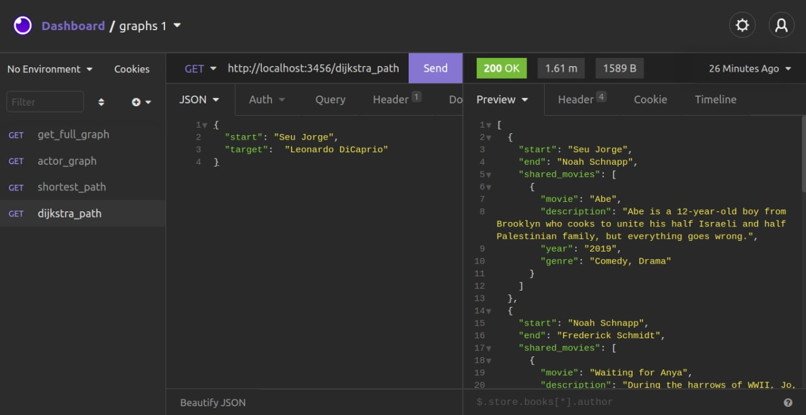
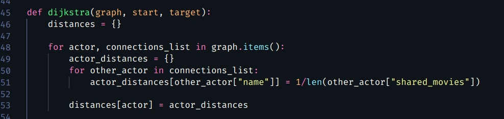
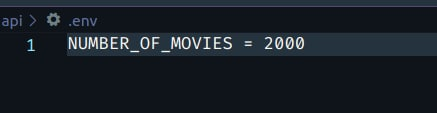

# Grafos2_IMDBConnection

Temas:
 - Grafos2

# 🕸️ IMDBConnection
  
**Número da Lista**: 14 
**Conteúdo da Disciplina**: Dijkstra  

## Alunos
|Matrícula | Aluno |
| -- | -- |
| 16/0119553  |  👨‍💻 Felipe Campos de Almeida |
| 16/0005736  |  👩‍💻 Fabiana Luiza Vasconcelos Pfeilsticker Ribas |

## Sobre ℹ️
O IMDBConnection utiliza um Internet Movie Database ou IMDb que é uma base de dados online de informação sobre cinema TV, música e games, hoje pertencente à Amazon, para aplicar a teoria de Kevin Bacon 🥓 de que todas as pessoas do mundo estão separadas por no máximo seis graus de distância. No nossso projeto, limitamos a base para atores e atrizes e os filmes correlacionados. Nosso trabalho propoem encontrar o vínculo mais curto entre o ator ou atriz de interesse e qualquer ator ou atriz alvo. Além disso utilizamos o algoritimo de Dijkstra para calcular o caminho entre atores e atrizes com o maior número de conexões.

## 📷 Screenshots 
Retorno da execução do projeto. Grafo dos atores com mais conexções.

O peso das arestas são calculados de acordo com a quantidades de filmes em que os atores atuaram juntos.(1/shared_movies)

Total de filmes pode ser modificado pra menos ou mais. Entretanto é recomendado não utilizar um valor muito alto pois isso pode impactar no tempo de execução

## ⚙️ Instalação 
**Linguagem**: 🐍 Python 
**Framework**: 🌶️ Flask e 💜 Insomnia 

### Para distribuição Linux 🐧 :

**Para a execução do projeto é necessário a instalação previa do docker e docker-compose.**

1) [Clone](https://help.github.com/en/articles/cloning-a-repository) o repositório do projeto. Para clonar vá ao terminal e digite:
~~~
$ git clone https://github.com/projeto-de-algoritmos/Grafos2_IMDBConnection.git
~~~

2) Entre na pasta do projeto:
~~~
$ cd Grafos2_IMDBConnection
~~~

3) Para compilar o projeto, entre a pasta /api e execute o comando do docker:
~~~
$ cd api
$ docker-compose up --build
~~~

4) Depois de realizar todos esses passos, aproveite o projeto e divirta-se!

## 💻 Uso 
Utilize o isominia para as requisições http. Siga o exemplo a baixo pra utilizar a rota. Escolha o seu artista favorito para testar a aplicação.😉

1) Visualize o menor caminho entre os atores ou atrizes enviado o payload a baixo para: http://localhost:3456/dijkstra_path
~~~
{ 
    "start": "Seu Jorge",
    "target":  "Leonardo DiCaprio"
}
~~~

## Outros 
Referências: [Video utilizado pra implementação do algoritimo de Dijkstra](https://www.youtube.com/watch?v=IG1QioWSXRI)
